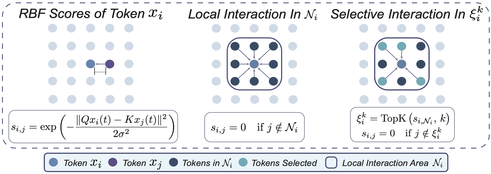

Code for ICML 2026 ["Krause Synchronization Transformers"](https://arxiv.org/abs/2602.11534)

# Krause Synchronization Transformers
This repository contains the implementation for the paper "Krause Synchronization Transformers". In our work, we introduce <strong>Krause Attention</strong>, a principled attention mechanism inspired by bounded-confidence consensus dynamics. Krause Attention replaces similarity-based global aggregation with distance-based, localized, and selectively sparse interactions, promoting structured local synchronization instead of global mixing. We relate this behavior to recent theory modeling Transformer dynamics as interacting particle systems, and show how bounded-confidence interactions naturally moderate attention concentration and alleviate attention sinks. Restricting interactions to local neighborhoods also reduces runtime complexity from quadratic to linear in sequence length. Empirically, we validate Krause Attention across diverse settings, including vision (ViT on CIFAR/ImageNet), autoregressive image generation (MNIST/CIFAR-10), large language models (Llama/Qwen), and language models trained from scratch at multiple scales (100M/200M). Across these domains, Krause Attention achieves consistent performance gains while improving computational efficiency, highlighting bounded-confidence dynamics as a scalable and effective inductive bias for attention.

## Krause Attention
<section class="hero teaser">
  <div class="container is-max-desktop">
    <div class="hero-body">
      <div class="has-text-centered">
         
             </div>
    </div>
  </div>
</section>

## Installation

To get started with Krause-Synchronization-Transformers, follow these steps:

### 1. Clone the Repository
```bash
git clone [https://github.com/Jingkun-Liu/Krause-Synchronization-Transformers.git](https://github.com/Jingkun-Liu/Krause-Synchronization-Transformers.git)
cd Krause-Synchronization-Transformers
```

### 2. Install Required Packages
```bash
pip install -r requirements.txt
```

## Project Structure
```text
Krause-Synchronization-Transformers/
├── autoregressive_transformers/
│   ├── cifar10/ 
│   │   │── cifar10_generate.sh
│   │   │── cifar10_train.sh
│   │   │── completion_cifar10.py
│   │   │── generate_cifar10.py
│   │   └── train_cifar10.py
│   ├── mnist/
│   │   │── mnist_generate.sh
│   │   │── mnist_train.sh
│   │   │── completion_mnist.py
│   │   │── generate_mnist.py
│   │   └── train_mnist.py
├── vision_transformers/
│   ├── cifar10/ 
│   │   │── ViT-S/
│   │   │   │── data.py
│   │   │   │── module.py
│   │   │   └── vit_s_main.py
│   │   │── KViT-S/
│   │   │   │── data.py
│   │   │   │── module.py
│   │   │   └── kvit_s_main.py
│   │   │── Swin-T/
│   │   │   │── data.py
│   │   │   │── module.py
│   │   │   └── swin_t_main.py
│   │   │── KSwin-T/
│   │   │   │── data.py
│   │   │   │── module.py
│   │   │   └── kswin_t_main.py
│   │   │── run_kswin.sh
│   │   │── run_kvit.sh
│   │   │── run_swin.sh
│   │   └── run_vit.sh
│   ├── imagenet1k/ 
│   │   │── KViT-S-16/
│   │   │   │── data.py
│   │   │   │── module.py
│   │   │   └── kvit_s_16_main.py
│   │   │── ViT-S-16/
│   │   │   │── data.py
│   │   │   │── module.py
│   │   │   └── vit_s_16_main.py
│   │   │── KViT-B-16/
│   │   │   │── data.py
│   │   │   │── module.py
│   │   │   └── kvit_b_16_main.py
│   │   │── ViT-B-16/
│   │   │   │── data.py
│   │   │   │── module.py
│   │   │   └── vit_b_16_main.py
│   │   │── run_kvit.sh
│   │   └── run_vit.sh
├── lora_llms/
│   ├── llama/ 
│   │   │── module.py
│   │   │── util.py
│   │   │── run_llama3_8b.sh
│   │   └── llama3_8b_main.py
│   ├── qwen/ 
│   │   │── module.py
│   │   │── util.py
│   │   │── run_qwen1.5_7b.sh
│   │   └── qwen1.5_7b_main.py
│   └── evaluation/ 
│       │── benchmark.py
│       │── util.py
│       │── evaluation.sh
│       └── main.py
├── language_models_100m/
│       │── build_fwe10bt.py
│       │── module.py
│       │── run_train_100m.sh
│       │── train_100m.py
│       └── training_utils.py
└── images/  # images/gifs used in readme and our website
```

## Datasets
* **Automatic Download**: The `CIFAR-10` and `MNIST` datasets will be automatically downloaded upon running the scripts.
* **Manual Download Required**:
    * **ImageNet-1K**: Please download from [https://www.image-net.org/download.php].
    * **LLM Datasets**: Relevant datasets can be found at [https://huggingface.co/datasets/SirNeural/flan_v2/tree/main].
    * **LLMs**: Llama3-8B can be found at [https://huggingface.co/meta-llama/Meta-Llama-3-8B]. Qwen1.5-7B can be found at [https://huggingface.co/Qwen/Qwen1.5-7B].
---
> **Local Dataset Release**:
> We have also prepared a set of locally curated datasets optimized for this project, which will be released soon to ensure reproducibility.

## Model Checkpoints
Checkpoints are available at https://drive.google.com/drive/folders/1wZ4MvuzXHPQO4IPaT2tANtnqlaNSCiZa?usp=sharing.

## Usage
We provide run scripts that can be submitted simply using sbatch for every task. For example, to run the ImageNet-1K classification task for KViT-S-16, use the following command:
```bash
/Krause-Synchronization-Transformers-main/vision_transformers/imagenet1k/run_kvit.sh
```
> Please ensure you modify the script's configuration (such as batch size, learning rate, model implementation path or GPU requirements) before execution.
>
> For instance, to run ImageNet-1K with KViT-S-16, the script should be adjusted as shown below:
```bash
# 1. Parameters Setting
SIGMAS="4.5"
DROPOUTS="0.0"

EPOCHS=300
LR=5e-4
WEIGHT_DECAY=0.05
BATCH_SIZE=512
NPROC_PER_NODE=2

FILE_SUFFIX="topk8-16_s${SIGMA}_d${DROPOUT}_w${WEIGHT_DECAY}_batchsize${BATCH_SIZE}"
LOG_FILE="log_kvits16_ImageNet_lr5e-4_${FILE_SUFFIX}.out"
SAVE_PATH="analysis_kvits16_ImageNet_lr5e-4_${FILE_SUFFIX}.png"

# 2. Torchrun Command
CUDA_VISIBLE_DEVICES=6,7 torchrun --nproc_per_node=2 --master_port=28888 kvit_b_16_main.py \
    --top_k 8 \
    --warmup_epochs 10 \
    --sigma $SIGMA \
    --dropout $DROPOUT \
    --epochs $EPOCHS \
    --lr $LR \
    --weight_decay $WEIGHT_DECAY \
    --batch_size $BATCH_SIZE \
    --save_path $SAVE_PATH \
    > $LOG_FILE 2>&1 &
```

## Citation
If you find this research useful, please consider citing our work!
```bash
@article{liukrause2026,
  title={Krause Synchronization Transformers},
  author={Jingkun Liu and Yisong Yue and Max Welling and Yue Song},
  journal={ArXiv},
  year={2026},
  url={https://arxiv.org/abs/2602.11534}
}
```
